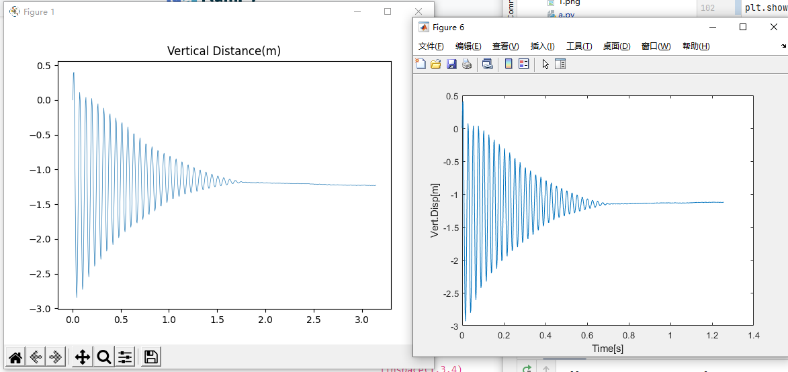

# Python Open-CV Samples

 

通过`open-cv`特征点识别和对点位追踪实现对监测对象位移量的计算。 主函数是 `a.py`

---

## Matlab

需要 computer vision包和image tool包

```matlab
clc;clear;close all

vi=fullfile('.\');
videoName='ExampleVideo.avi';

videoReader=VideoReader(fullfile(vi,videoName));
frameRate=videoReader.FrameRate;
frame=readFrame(videoReader);
figure;
imshow(frame);
jointID=1;
roi=drawrectangle;

points=detectORBFeatures(im2gray(frame),'ROI',roi.Position);
figure;
im=insertShape(frame,'Rectangle',roi.Position,'Color','red');
im=insertMarker(im,points.Location,'+','Color','white');
imshow(im);title([num2str(size(points,1)),"points detected"]);

```


```matlab
tracker=vision.PointTracker('MaxBidirectionalError',1);
initialize(tracker,points.Location,frame);
videoPlayer=vision.VideoPlayer();
N=videoReader.NumFrames-1;
pos=zeros(N+1,size(points.Location,1),2);
pos(1,:,:)=points.Location;
for I=1:N
	disp(['Processing Images: ',num2str(I)])
    frame=readFrame(videoReader);
    [points,validity]=tracker(frame);
    out=insertMarker(frame,points(validity,:),'+');
    videoPlayer(out);
    pos(I+1,:,:)=points;
end


clear Disp2D
Disp2D=pos-pos(ones(1,N+1),:,:);
t=(1:(N+1))/frameRate;
figure;
subplot(2,1,1);plot(t,squeeze(Disp2D(:,:,1)));xlabel('Time[s]');ylabel('Disp(X)[px]');
subplot(2,1,2);plot(t,squeeze(Disp2D(:,:,2)));xlabel('Time[s]');ylabel('Disp(Y)[px]');
```


```matlab
Disp2D_ave = squeeze(mean(Disp2D, 2));
Fdd = fft(Disp2D_ave);
F =(0:N) * frameRate/N;
figure;
subplot(2, 1, 1);plot(t,Disp2D_ave(:, 1)) ;xlabel('Time[s]');ylabel('Ave.Disp(X) [pixels]');
subplot(2, 1, 2);plot(t,Disp2D_ave(:, 2)) ;xlabel('Time[s]');ylabel('Ave.Disp(Y) [pixels]');

%% Pixel-to- meter conversion of di splacement
% set the time to 0.0
videoReader.CurrentTime = 0.0;
frame = readFrame(videoReader);
figure; imshow(frame);
l = drawline;
% estimate the scaling factor
dist_m=2; % Known physical distance
dist_px = l.Position(2,2) - l.Position(1,2);
px2m = dist_m/dist_px;
% apply scale
Disp_m = px2m * Disp2D_ave; %first column: 1ongitudinal，second column: vertical
dt = 1/500;
Time = 0:dt: (length(Disp_m(:, 1))-1)*dt;
%p1otting
figure;
plot(Time,-Disp_m(1:end,2));xlabel('Time[s]');ylabel('Vert.Disp[m]')

```


## Python

以下演示widnows下python调用opencv技术。

步骤：

1、安装 pycharm

2、在pycharm中使用pip install 命令报错 权限相关，打开powershell执行如下

```sh
set-ExecutionPolicy RemoteSigned
```

如果仍然无法下载，关掉FQ软件


```shell
pip install -i https://pypi.mirrors.ustc.edu.cn/simple  --default-timeout=1000 cs2 

pip install -i https://pypi.tuna.tsinghua.edu.cn/simple  --default-timeout=1000 matplotlib

pip install -i https://pypi.mirrors.ustc.edu.cn/simple  --default-timeout=1000  opencv-contrib-python
```


在windows上安装opencv-python

https://docs.opencv.org/3.4/d5/de5/tutorial_py_setup_in_windows.html

下载最新发布 https://github.com/opencv/opencv/releases 解压

1. Goto **opencv/build/python/2.7** folder. (这里把cv2目录整个复制到venv的site-packages中生效)

2. Copy **cv2.pyd** to **C:/Python27/lib/site-packages**.

3. Open Python IDLE and type following codes in Python terminal.

   \>>> import cv2 as cv

   \>>> print( cv.__version__ )


## python 与 matlab结果对比

水平方向和垂直方向位移量(pixels)随时间变化曲线


水平方向和垂直方向（多关键点的）**平均**位移量(pixels)随时间变化曲线


水平方向和垂直方向位移量(m)随时间变化曲线




## 附录

**numpy matlab 函数对应**

https://numpy.org/doc/stable/user/numpy-for-matlab-users.html

**matplotlib使用**

https://www.runoob.com/w3cnote/matplotlib-tutorial.html
